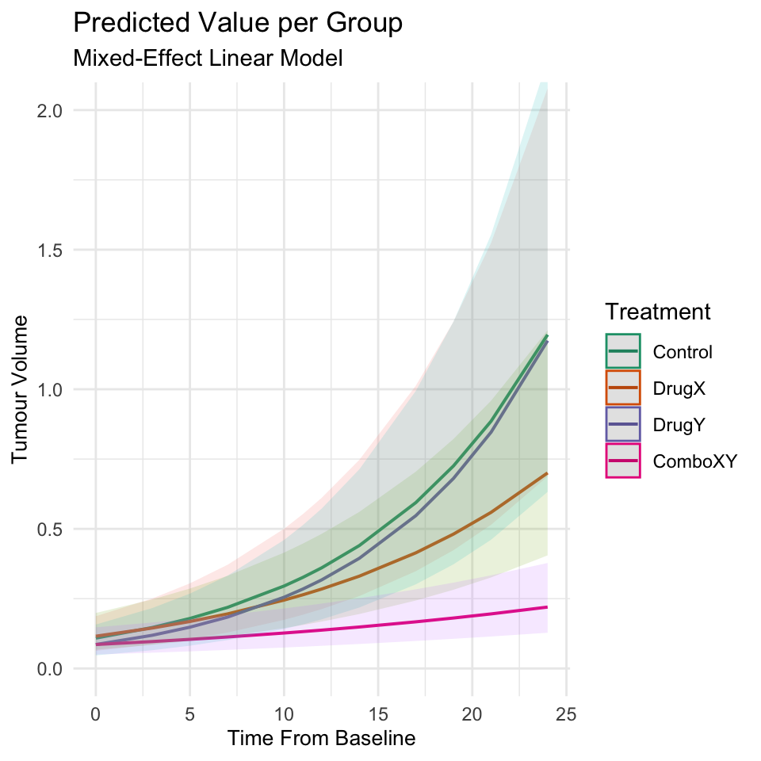

<!-- README.md is generated from README.Rmd. Please edit that file -->

# SQUEAK - Statistical Quantification & Understanding of Experimental Animal Kinetics

SQUEAK is a simple package to perform regression modelling and
subsequent visualisation of mouse tumour growth data. It is designed to
provide accessible access to high quality statistical analysis to
support comparisons between groups, while accounting for the inherent
variability between individual animals.

This package stands on the shoulders of giants, and wraps a number of
excellent other tools that should be given due credit, principally:
nlme, ggplot2 and sjPlot.

## Installation

You can install the development version of SQUEAK from
[GitHub](https://github.com/) with:

``` r
# install.packages("devtools")
devtools::install_github("seedgeorge/SQUEAK")
```

## Minimal Usage Example

The following code uses a dataset included in the package, performs a
simple data check, and then makes a simple plot.

``` r
library(SQUEAK)
#> Loading required package: ggplot2
data("long_mice")
ready_data = check_long(long_mice,
                        timecol = "Days",
                        IDcol = 'Number',
                        groupcol = 'Group',
                        measurementcol = 'Value')
#> ✔ All columns detected!
#> ✔ Data types good!
#> ℹ 4 Groups Detected
#> ℹ Data structure suggests nested model, with unique individuals per group.
#> ℹ Groups: "Control", "DrugX", "DrugY", and "ComboXY"
#> ℹ Assuming reference level: "Control"
#> ! 294 rows with NA detected, dropping these rows.
#> ✔ 181 rows remaining.
#> Data statistics:
#> ℹ 19 Individuals
#> ℹ Start Time: 0
#> ℹ End Time: 24
#> ℹ Minimum measurement: 0.03106832625
#> ℹ Maximum measurement: 1.42182667828125
plot_raw_lines(ready_data = ready_data) 
#> ! No title specified, using default.
#> ! No subtitle specified, using default.
```


In this data, each line represents one mouse, and the mice are grouped
in treatment arms.

The next step is to make a mixed-effect regression model, which can also
be plotted.

``` r
mixed_model = mixed_effect_model(ready_data = ready_data)
#>   0:     285.35575: -0.697490
#>   1:     285.35575: -0.697490
plot_modelled_curves(mixed_model)
#> Model has log-transformed response. Back-transforming predictions to
#>   original response scale. Standard errors are still on the transformed
#>   scale.
#> Scale for y is already present.
#> Adding another scale for y, which will replace the existing scale.
#> Scale for colour is already present.
#> Adding another scale for colour, which will replace the existing scale.
```


